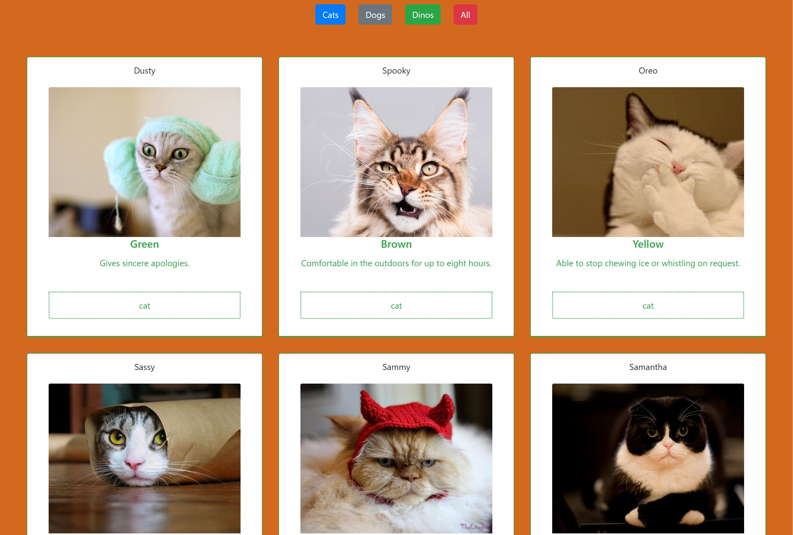

# Animal Adoption

This project is an exploration of javascript sorting functions. I printed all animal cards the dom and added the ability to hide and show specific animal cards according to animal type. 

## Screenshots


## How to run this project
* Use npm to install http-server in your terminal:
```sh
npm install -g http-server
```
* Run the server in your terminal
```sh
hs -p 9999
```
* Open chrome and navigate to:
```
localhost:9999
```